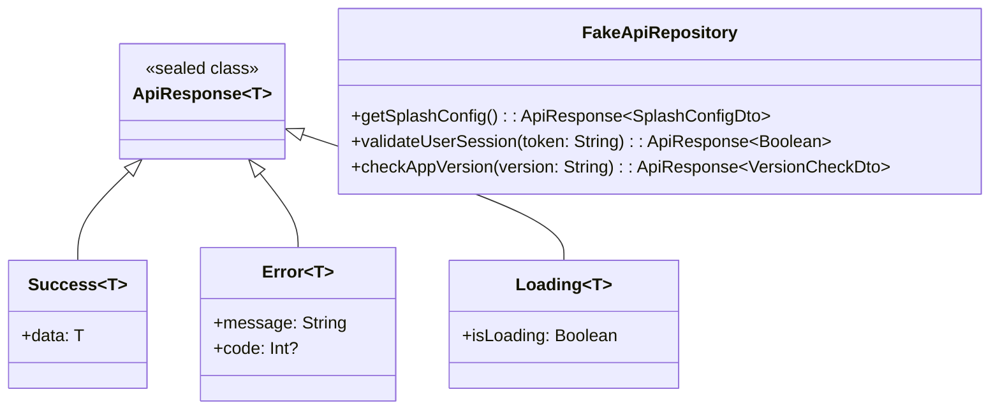
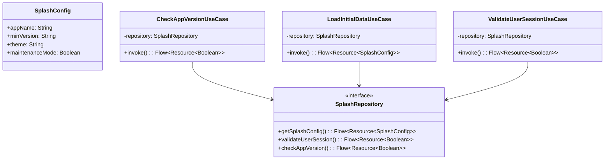

# MyApplication5 - Clean Architecture con Kotlin Multiplatform

## 📋 Descripción del Proyecto

Aplicación móvil desarrollada con **Kotlin Multiplatform** siguiendo los principios de **Clean Architecture**. 
Utiliza **Jetpack Compose**, **Koin** para inyección de dependencias, **ViewModel** y patrón **MVI**.

## 🏗️ Arquitectura

### Principios de Clean Architecture
- **Separación de responsabilidades** por capas
- **Inversión de dependencias** 
- **Independencia de frameworks**
- **Testabilidad** en todas las capas

### Capas de la Arquitectura

```
┌─────────────────────────────────────────┐
│                UI Layer                 │
│            (Compose UI)                 │
├─────────────────────────────────────────┤
│           Presentation Layer            │
│     (ViewModels, States, Intents)       │
├─────────────────────────────────────────┤
│            Domain Layer                 │
│    (Use Cases, Models, Repositories)    │
├─────────────────────────────────────────┤
│             Data Layer                  │
│  (Repository Impl, DataSources, DTOs)   │
├─────────────────────────────────────────┤
│             Core Layer                  │
│      (Network, Utils, Constants)        │
└─────────────────────────────────────────┘
```

## 📁 Estructura del Proyecto

```
composeApp/src/commonMain/kotlin/
├── di/                          # Inyección de Dependencias (Koin)
│   ├── AppModule.kt            # Módulo principal de Koin
│   ├── NetworkModule.kt        # Configuración de red y data sources
│   ├── RepositoryModule.kt     # Configuración de repositorios
│   ├── UseCaseModule.kt        # Configuración de casos de uso
│   └── ViewModelModule.kt      # Configuración de ViewModels
├── core/                        # Funcionalidades Core
│   ├── network/
│   │   ├── FakeApiRepository.kt # Simulador de API
│   │   └── ApiResponse.kt      # Wrapper de respuestas
│   └── util/
│       ├── Resource.kt         # Wrapper de recursos
│       └── Constants.kt        # Constantes globales
└── feature/                     # Features de la App
    └── splash/                  # ✅ Feature Splash (COMPLETADA)
        ├── data/
        │   ├── datasource/
        │   │   ├── local/
        │   │   │   └── SplashLocalDataSource.kt
        │   │   └── remote/
        │   │       └── SplashRemoteDataSource.kt
        │   ├── model/
        │   │   ├── SplashConfigDto.kt
        │   │   ├── VersionCheckDto.kt
        │   │   └── SplashConfigMapper.kt
        │   └── repository/
        │       └── SplashRepositoryImpl.kt
        ├── domain/
        │   ├── model/
        │   │   └── SplashConfig.kt
        │   ├── repository/
        │   │   └── SplashRepository.kt
        │   └── usecase/
        │       ├── CheckAppVersionUseCase.kt
        │       ├── LoadInitialDataUseCase.kt
        │       └── ValidateUserSessionUseCase.kt
        ├── presentation/
        │   ├── SplashUiState.kt
        │   └── SplashViewModel.kt
        └── ui/
            └── SplashScreen.kt
```

## 🎯 Features Implementadas

### ✅ Splash Feature (COMPLETADA)
- **Arquitectura completa implementada:**
  - **Data Layer:** DTOs, DataSources (Local/Remote), Repository Implementation
  - **Domain Layer:** Models, Repository Interface, Use Cases
  - **Presentation Layer:** ViewModel, UI States, Compose UI
  
- **Casos de Uso:**
  - `CheckAppVersionUseCase`: Verificación de versión de la app
  - `LoadInitialDataUseCase`: Carga de configuración inicial
  - `ValidateUserSessionUseCase`: Validación de sesión de usuario

- **Funcionalidades:**
  - Pantalla de splash con animaciones
  - Verificación de modo mantenimiento
  - Validación de versión de app
  - Manejo de errores y estados de carga
  - Navegación automática según estado

### 🔐 Login Feature (Pendiente)
- **Casos de Uso:**
  - `LoginUseCase`: Autenticación
  - `ValidateEmailUseCase`: Validación de email
  - `ValidatePasswordUseCase`: Validación de contraseña

### 🏠 Home Feature (Pendiente)
- **Casos de Uso:**
  - `GetUserProfileUseCase`: Obtener perfil
  - `LoadHomeDataUseCase`: Cargar datos del dashboard
  - `LogoutUseCase`: Cerrar sesión

## 📊 Diagramas de Clases

### Core Layer - Network



### Splash Feature - Domain Layer



## 🔧 Tecnologías Utilizadas

- **Kotlin Multiplatform**: Código compartido entre Android e iOS
- **Jetpack Compose**: UI declarativa
- **Koin**: Inyección de dependencias
- **Coroutines & Flow**: Programación asíncrona
- **ViewModel**: Manejo de estado
- **MVI Pattern**: Model-View-Intent

## 📝 Registro de Cambios

### [v1.0.0] - 2024-01-XX - Implementación Completa de Splash Feature

#### ✅ Completado
- **Estructura completa del proyecto** con Clean Architecture
- **Core Layer implementado:**
  - `FakeApiRepository` para simulación de API
  - `ApiResponse` sealed class para manejo de respuestas
  - `Resource` wrapper para estados de UI
- **Configuración completa de Koin** para inyección de dependencias
- **Feature Splash completamente implementada:**
  - Data Layer: DTOs, DataSources, Repository Implementation
  - Domain Layer: Models, Repository Interface, Use Cases
  - Presentation Layer: ViewModel con patrón MVI, UI States
  - UI Layer: Compose Screen con animaciones y navegación
- **Navegación básica** entre pantallas (Splash → Login → Home)
- **Imports específicos** sin wildcards para mejor rendimiento
- **Compilación exitosa** sin errores ni advertencias

#### 🔧 Tecnologías Integradas
- Kotlin Multiplatform con commonMain
- Jetpack Compose para UI
- Koin para inyección de dependencias
- Coroutines & Flow para programación asíncrona
- ViewModel con patrón MVI
- Clean Architecture con separación de capas

#### 📋 Pendiente
- Feature Login completa
- Feature Home completa
- Tests unitarios
- Documentación de API
- Configuración de CI/CD

---

## 🚀 Próximos Pasos

1. **Implementar Feature Login** siguiendo la misma arquitectura
2. **Implementar Feature Home** con dashboard
3. **Agregar tests unitarios** para todas las capas
4. **Configurar navegación avanzada** con Navigation Compose
5. **Implementar persistencia local** con Room/SQLDelight

---

**Última actualización:** Enero 2024
**Versión:** 1.0.0
**Estado:** Splash Feature completada ✅